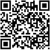

# Pentesting Swiss Army Knife (P-SAK)

<p align="center">

</p>

## What is P-SAK?

Pentesting Swiss Army Knife (P-SAK) is a Docker Image with the **eleven** ( four optional ) most used tools for Hacking and Pentesting. It allows you to use these tools easily and quickly on your Pentest from any OS supporting the Docker Engine. It has been developed using [bitnami-docker-python](https://github.com/bitnami/bitnami-docker-python) as the base image and installing the following tools:
* [NMAP](https://nmap.org/) - Utility for network , ports and service discovery in addition to security auditing.
* [Metasploit](https://github.com/rapid7/metasploit-framework) - Most used penetration testing framework.
* [Commix](https://github.com/commixproject/commix) - Automated tool to test web-based applications with the view to find vulnerabilities related to command injection.
* [Reconspider](https://github.com/bhavsec/reconspider) - OSINT Framework for scanning IP Address, Emails, Websites, Organizations and find out information from different sources.
* [Wfuzz](https://github.com/xmendez/wfuzz)- It replaces any web reference to the FUZZ keyword by the value of a given payload.
* [John the Ripper](https://www.openwall.com/john/) - Password cracking software tool.
* [Tcpdump](https://www.tcpdump.org/manpages/tcpdump.1.html) - Data-network packet analyzer

Optional tools:
* [SQLMAP](https://github.com/Xayias/https-github.com-sqlmapproject-sqlmap) - Tool that automates the process of detecting and exploiting SQL injection flaws and taking over of database servers.
* [Nikto](https://github.com/sullo/nikto) - Web server vulnerabilities scanner.
* [Hydra](https://github.com/vanhauser-thc/thc-hydra) - Password brute force cracking tools.
* [Aircrack-ng](https://www.aircrack-ng.org/) - Complete suite of tools to assess WiFi network security.

## Building

You can build P-SAK using the following command:

```console
$ git clone https://github.com/leoanggal1/P-SAK.git
$ cd P-SAK
$ docker build -t <image-tag> .
```

#### Environment variables

You can build the image along with other optional tools using the environment variables in the Dockerfile.

| Tool        | Environment Variable   | Default Value |
| ----------- | ---------------------- | ------------- |
| SQLMAP      | `SQLMAP_INSTALL`       | `no`          |
| Nikto       | `NIKTO_INSTALL`        | `no`          |
| Hydra       | `HYDRA_INSTALL`        | `no`          |
| Aircrack-ng | `AIRCRACK_INSTALL`     | `no`          |

To enable these tools you have to change the default value of environment variables to `yes`.
For example, if you need Aircrack-ng and Nikto for your Pentest you must change the `Dockerfile` like this:

```console
 ENV SQLMAP_INSTALL="no" \
	NIKTO_INSTALL="yes" \
	HYDRA_INSTALL="no" \
	AIRCRACK_INSTALL="yes"
```

#### Non-root user

P-SAK has been developed to be a **non-root** image, following security best practises. The user `psak` has the UID `1001`.
If you need root privileges execute the image like the following:

```console
docker run --user 0 <image-tag>
```

## Usage

#### Bash mode

You can run the image in interactive mode with the command:

```console
$ docker run --rm -it <image-tag> bash
```

#### As a tool

If you only need to run one P-SAK tool, you can use the following command:

```console 
$ docker run -ti <image-tag> <tool-name> <tool-options>
```

For example, to run a port scan using NMAP, use the following command:

```console
$ docker run -it <image-tag> nmap -sV --min-rate 5000 <target-ip>
```

The output obtained:
<p align="center">

</p>

## Contributing

Want to contribute? Great!! You can request new features or create PR, we love contributions!

## Contact Developer

* Email:  leopol.angul0@gmail.com
* LinkedIn: [Leopoldo Angulo Gallego](https://www.linkedin.com/in/leopoldo-angulo-gallego-66b957195)

## Legal Disclaimer

> Usage of P-SAK image for attacking targets without prior mutual consent is illegal.
> It is the end user's responsibility to obey all applicable local, state and federal laws.
> Developers assume no liability and are not responsible for any misuse or damage caused by this image.

## Help us

Found this project useful? If you want, you might donate.

* For donate BTC : **39n4G7byFu5XWrmXfdAirDoWLR8mbtwhoD**
<p align="center">

</p>
